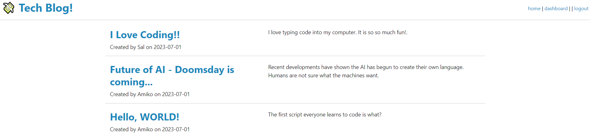
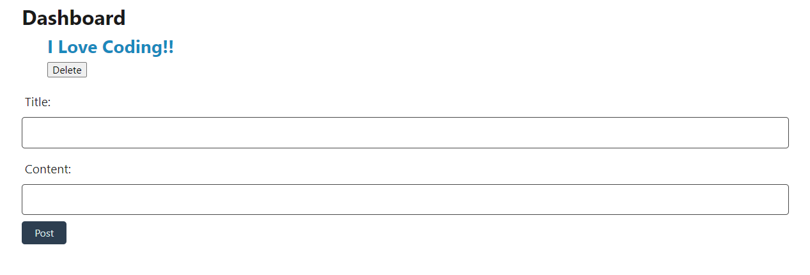
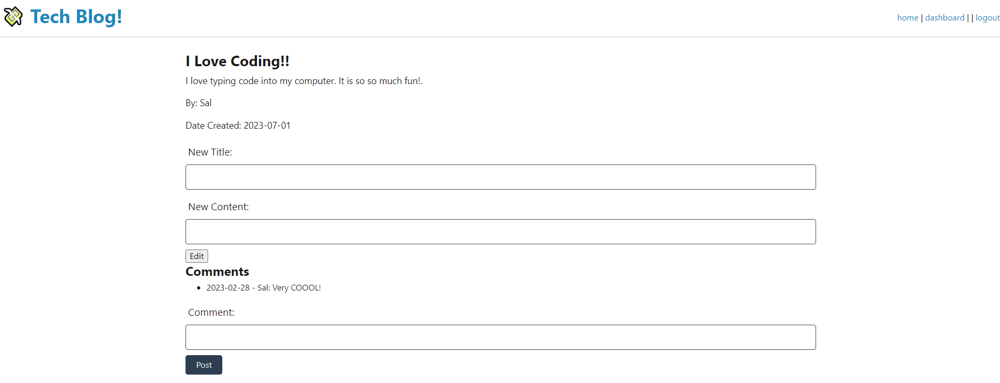
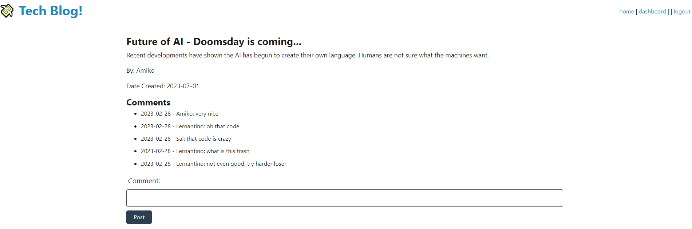

# Tech Blog

The following challenge involved creating a tech blog. The application requires the user to either log-in or create an account. Without an account, the user can only view the homepage. Once the user is logged in they can:
-	View blogs in detail
-	View and post comments
-	Post their own blogs
-	Edit their blogs
-	Delete their blogs
-	View their posted blogs
Users will be unable to edit or delete blogs created by others. All blogs feature a title, created date, author, and description.

Live Application: 

## Installation

Please install libraries and run on a console. Prior to starting the application, please open your local SQL server and run "schema.sql".

The password for your local server should be entered in the .env.EXAMPLE file. Please rename the file to .env once completed.

Run the command line node ./seeds/index.js to seed the database.

Run server (npm start) and use Insomnia to test API calls.

## Technologies Used

- Node.js
- Sequelize
- Express
- Dotenv
- Handlebars
- Express-Session
- Bcrypt

## License

none
